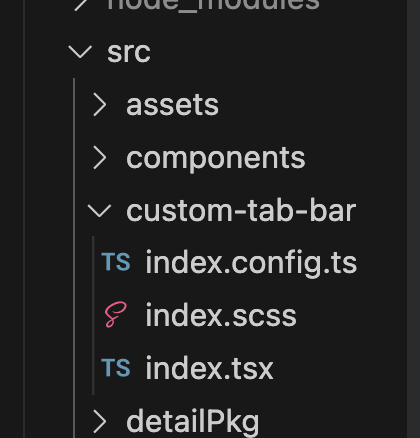

# 自定义实现 Tabbar 方案

:::note

官方推荐的 custom-tab-bar 只能实现一次性渲染 Tabbar，[官方 GitHub](https://github.com/NervJS/taro/tree/next/examples/custom-tabbar-react)

:::

### 添加所有需要显示的 Tabbar 内容

:::caution

如果添加的内容不全，则会导致切换时显示不到需要展示的内容

:::

```typescript
  tabBar: {
    custom: true,
    color: "#a1a7b3",
    selectedColor: "#1492ff",
    backgroundColor: "#ffffff",
    list: [
      {
        pagePath: "pages/index/index",
        text: "首页",
        iconPath: "./assets/images/home.png",
        selectedIconPath: "./assets/images/home_select.png",
      },
      {
        pagePath: "pages/user/index",
        text: "我的",
        iconPath: "./assets/images/my.png",
        selectedIconPath: "./assets/images/my_select.png",
      },
      {
        pagePath: "pages/enterprise/index",
        text: "首页",
        iconPath: "./assets/images/home.png",
        selectedIconPath: "./assets/images/home_select.png",
      },
      {
        pagePath: "pages/position/index",
        text: "信息发布",
        iconPath: "./assets/images/position.png",
        selectedIconPath: "./assets/images/position_select.png",
      },
      {
        pagePath: "pages/company/index",
        text: "企业中心",
        iconPath: "./assets/images/my.png",
        selectedIconPath: "./assets/images/my_select.png",
      },
    ],
  },
```

上述代码片段中，个人身份登录需要显示的`我的`和`首页`，切换成企业身份之后需要显示`首页`和`信息发布`以及`企业中心`

### 创建 custom-tab-bar 文件夹

在 src 目录下创建一个 custom-tab-bar 文件夹用于实现自定义 Tabbar 的渲染操作


其中`index.tsx`主要就是实现自定义渲染 Tabbar, 并且名称一定是 custom-tab-bar

:::info
主要思路：

- useReducer 和 useConetxt 实现全局数据缓存
- 保存当前点击的节点以及不同身份需要渲染的 tabbar 数据（每次点击都会触发 custom-tab-bar 组件的渲染，使用 useState 控制会导致页面数据刷新之后，tabbar 没有更新，具体原因还没有找出来）
- 切换身份通过 dispatch 更新 list，从而实现渲染不同的 tabbar

:::

1. 创建全局的 Store，缓存数据

```typescript
const initState = {};

const customReducer = (state, action) => {};

const CustomContext = createContext<any>(initStata);

export { customReducer, initStata, CustomContext };
```

2. 在 app.ts 里边创建上下文

```typescript
const [state, dispatch] = useReducer(customReducer, initStata);

return (
  <CustomContext.Provider value={{ state, dispatch }}>
    {props.children}
  </CustomContext.Provider>
);
```

3. 在 custom-tab-bar 的组件里通过`CoverView`和`CoverImage`实现 tabbar 效果

```typescript
<CoverView className="tab-container">
  {state.barList.map((tab: any, index) => {
    return (
      <CoverView
        key={index}
        className="tab-item"
        onClick={() => switchTab(tab)}
      >
        <CoverImage
          className="tab-icon"
          src={state.tabIndex === tab.key ? tab.selectedIconPath : tab.iconPath}
        />
        <CoverView
          className={
            state.tabIndex === tab.key ? "tab-text-select" : "tab-text"
          }
        >
          {tab.text}
        </CoverView>
      </CoverView>
    );
  })}
</CoverView>
```

:::tip

从其他页面跳转到 Tabbar 页面一定使用 Taro.switchTab()的方法

:::
到此基本上就完成了根据不同的用户身份渲染不同的 tabbar 内容，思路仅供参考。
